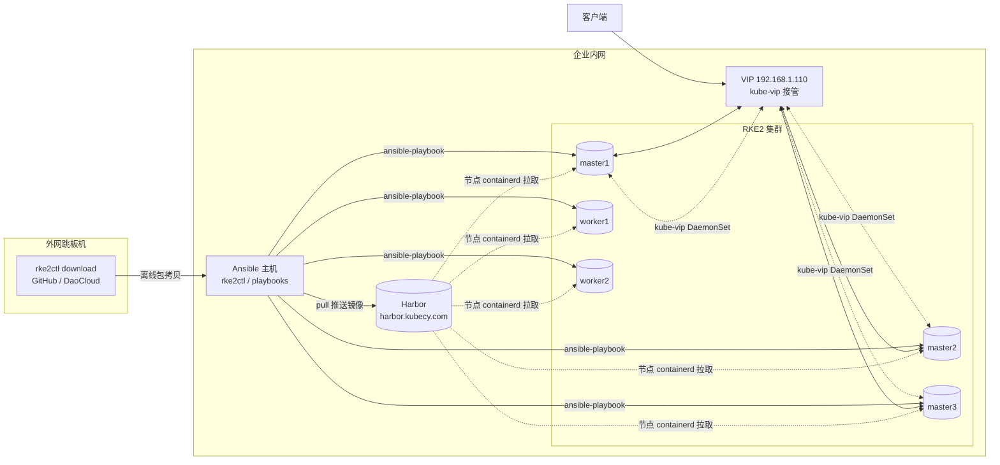
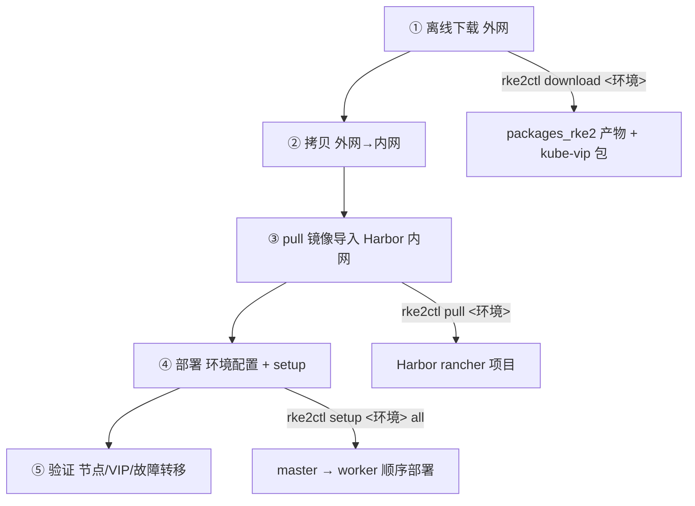

# Rke2Ops
<!-- Logo -->


<!-- Rke2Ops 完整版徽章 -->
<a href="#"></a>
<a href="#"></a>
<a href="#"></a>
<a href="#"></a>
<a href="#"></a>
<a href="#"></a>
<a href="https://github.com/kubecy/Rke2Ops/stargazers"></a>

# Rke2Ops — RKE2 离线交付与自动化部署平台

基于 Ansible + `rke2ctl` 的 RKE2 Kubernetes 生产级交付工具链：**离线资源下载 → 内网镜像导入 → 一键部署 → 健康验证**全流程自动化，内置 kube-vip 控制面 HA，无需外部 LB。

## 特性

- **全离线交付**：外网一次下载全部安装包与镜像（含 kube-vip），内网环境零外网依赖
- **kube-vip 控制面 HA**：VIP 由 DaemonSet 动态接管，故障自动漂移，替代 keepalived + haproxy，无需独立 LB 节点
- **多环境隔离**：`inventory/<环境名>` 独立维护 hosts / site.yml / secrets.yml，互不影响
- **一条命令**：`rke2ctl setup <环境> all` 顺序完成 rke2-server → rke2-agent 全量部署，支持 tab 补全
- **镜像链路一致**：下载、推送、节点拉取全链路统一 `rancher/` 命名，私有仓库即拉即用

---

## 1. 架构与主机规划

### 1.1 拓扑



### 1.2 主机规划

| 节点角色           | 主机名           | IP            | 数量 | 说明                                     |
| ------------------ | ---------------- | ------------- | ---- | ---------------------------------------- |
| 控制面 + etcd      | `<env>-masterN`  | 192.168.1.6x  | ≥1   | 组 `[rke2_server]`，有且仅有一台 `init_master=true` |
| Worker             | `<env>-workerN`  | 192.168.1.7x  | ≥0   | 组 `[rke2_agent]`，可与 master 同时部署   |
| Harbor 私有仓库    | `harbor.kubecy.com` | 192.168.1.150 | 1   | 需要预先创建 `rancher` 项目               |
| Ansible 控制主机   | 跳板机 / 工作站  | -             | 1    | 持有本工程与离线包，执行 rke2ctl          |
| VIP（HA 地址）     | -                | 192.168.1.110 | 1    | 由 kube-vip 在 master 间漂移，见 1.3      |

规划要点：

- master 建议 3 台（etcd 容错 ≥1）；worker 按业务规模扩容，`init_master=true` 必须且只能标记一台
- 所有 master 需具备 root/sudo 能力；SSH 用户建议统一为 `admin`（`ssh_user` 可配置）
- 节点需能访问 Harbor（`harbor.kubecy.com`），不需要任何公网出口

### 1.3 VIP 规划（kube-vip 控制面 HA）

kube-vip 以 DaemonSet 形式只部署在 **control-plane 节点**，通过 VRRP/ARP 抢占 VIP，Leader Election 持有者接管 VIP 与 9345/6443 流量；主节点故障时 VIP 自动漂移至存活 master（租约 15s）。

| 配置项 | 值 | 说明 |
| ------ | -- | ---- |
| `global.kube_vip` | `192.168.1.110` | VIP 地址，必须与 master 同网段且**不在 DHCP 池内** |
| `global.kube_vip_interface` | `ens160` | 与**所有 master 网卡名一致**（`ip -4 addr` 核对），不一致则无法绑定 |
| `global.kube_vip_version` | `v1.2.3` | kube-vip 镜像版本，留空则不部署 kube-vip |

> ⚠️ `rke2_server.tls_san[0]` 必须为 `{{ global.kube_vip }}`（证书 SAN 首项，且 master2/3、worker 均经 `https://VIP:9345` 加入集群）。

### 1.4 工程目录结构

```
Rke2Ops/
├── rke2ctl                     # 总控脚本: 环境/下载/推送/部署/补全
├── playbooks/
│   ├── rke2-server.yml         # 部署控制面 (master)
│   └── rke2-agent.yml          # 部署 worker
├── roles/
│   ├── prepare/                # 基础初始化 (用户/目录/离线包分发)
│   ├── rke2-server/            # 含 kube-vip.yaml.j2 (HA 清单)
│   └── rke2-agent/
├── inventory/
│   ├── sample/                 # 环境模板 (复制即得新环境)
│   └── <环境名>/               # 独立环境: hosts / site.yml / secrets.yml
└── packages_rke2/
    └── <环境名>/<版本>/<架构>/ # 离线包 (download 产物, 含 kube-vip 镜像包)
```

---

## 2. 总体流程（五步交付）



| 步骤 | 执行位置 | 命令 | 产出 |
| ---- | -------- | ---- | ---- |
| ① 离线下载 | 外网机器（有 docker） | `rke2ctl download <环境>` | 安装包 + 镜像包 + kube-vip 包 |
| ② 拷贝内网 | 外网 → 内网 | scp/rsync | 工程 + `packages_rke2/` |
| ③ 导入镜像 | 内网（可访问 Harbor） | `rke2ctl pull <环境>` | Harbor 内全部镜像 |
| ④ 部署 | Ansible 主机 | `rke2ctl setup <环境> all` | 集群就绪 |
| ⑤ 验证 | Ansible 主机 | kubectl / curl | 节点、VIP、HA 均验证通过 |

---

## 3. 离线下载（外网机器执行）

在外网跳板机/笔记本上执行，自动读取该环境 `site.yml` 的 `rke2_version`、`arch`、`rke2_server.cni`、`global.kube_vip_version`，下载**全部所需文件**并按 `sha256sum` 校验：

```shell
./rke2ctl download cq-moone-k45
```

产物落盘 `packages_rke2/<环境名>/<版本>/<架构>/`：

```
packages_rke2/cq-moone-k45/v1.36.3+rke2r1/amd64/
├── install.sh                       # RKE2 一键安装脚本
├── rancher-load-images.sh           # 镜像导入辅助脚本
├── rke2.linux-amd64.tar.gz          # RKE2 核心程序包
├── sha256sum-amd64.txt              # 全部包 SHA256 校验值
├── rke2-images-all.linux-amd64.txt  # 全量镜像清单
├── rke2-images.linux-amd64.tar.gz   # 核心组件 + 默认 CNI 镜像
├── rke2-images-cilium.linux-amd64.tar.gz  # CNI 镜像包 (按 cni 配置下载)
└── kube-vip-image-v1.2.3.tar.gz     # kube-vip 镜像包 (配置了 kube_vip_version 时)
```

要点：

- **GitHub 加速**：`site.yml` 的 `download_proxy` 空格分隔多个加速前缀，依次尝试直至成功，留空则直连
- **kube-vip 镜像**：经 DaoCloud GHCR 代理 `ghcr.m.daocloud.io/kube-vip/kube-vip:<版本>` 拉取，导出为 `rancher/kube-vip-kube-vip:<版本>` 并**幂等追加**到镜像清单，同时自动写入 `kube-vip-image-*.tar.gz` 离线包
- **幂等**：已存在的文件自动跳过；清单追加不重复；校验失败会明确报错，修复后重跑同一命令即可

---

## 4. 拷贝到内网环境

将整个工程（含离线包）拷贝到内网 Ansible 主机：

```shell
# 外网机器上执行
rsync -avzP Rke2Ops/ admin@<内网Ansible主机IP>:~/Rke2Ops/
```

> 建议整体拷贝：工程自带 `rke2ctl`、playbooks、inventory，后续全部步骤在 Ansible 主机上完成。
> 若内网另有独立机器负责镜像导入（如 Harbor 服务器本身），至少需将 `packages_rke2/<环境名>/` 与 `rancher-load-images.sh` 拷贝过去。

---

## 5. 镜像导入私有仓库（内网执行）

前置条件：

1. Harbor 已创建 **`rancher` 项目**（全部镜像推送至该项目下）
2. 执行机器可访问 Harbor 且有 docker；`site.yml` 已配置 `global.docker_repo.host / user / password`

执行：

```shell
./rke2ctl pull cq-moone-k45              # registry 缺省取 site.yml 的 global.docker_repo.host
# 或指定其他仓库:
./rke2ctl pull cq-moone-k45 registry.example.com
```

内部流程（对每个镜像包重复）：

1. `sed` 去除镜像清单的 `docker.io/` 前缀（幂等）
2. `docker login <registry>`（凭据来自 site.yml）
3. `docker load` 导入镜像包，**按本地已加载镜像过滤清单**，避免 "No such image" 噪音
4. `rancher-load-images.sh` 批量打 tag 并 push 至 `<registry>/rancher/*`

完成后镜像落位：

```
harbor.kubecy.com/rancher/rancher-mirrored-*       # RKE2 核心/CNI 镜像
harbor.kubecy.com/rancher/kube-vip-kube-vip:v1.2.3 # kube-vip 镜像
```

> ⚠️ kube-vip DaemonSet 使用**全限定路径** `{{ global.docker_repo.host }}/rancher/kube-vip-kube-vip:<版本>`，与 push 路径完全一致；RKE2 的 `system-default-registry` 不会改写用户 manifests 中的镜像，故必须保证该路径在 Harbor 中真实存在。

验证（Harbor 机器或任一可访问节点）：

```shell
curl -u admin:<密码> https://harbor.kubecy.com/api/v2.0/projects/rancher/repositories?page_size=50
```

---

## 6. 部署

### 6.1 创建环境（首次）

```shell
./rke2ctl new cq-moone-k45        # 复制 sample 模板 + 加密 secrets.yml + 建 packages_rke2 目录
./rke2ctl list                    # 查看全部环境
```

### 6.2 配置三件套

**① hosts — 主机清单**（`inventory/<环境名>/hosts`）：

```ini
[rke2_server]
cq-moone-master1 ansible_host=192.168.1.61 init_master=true
cq-moone-master2 ansible_host=192.168.1.62
cq-moone-master3 ansible_host=192.168.1.63

[rke2_agent]
cq-moone-worker1 ansible_host=192.168.1.71
cq-moone-worker2 ansible_host=192.168.1.72
```

**② site.yml — 环境变量**（关键项）：

| 配置项 | 说明 |
| ------ | ---- |
| `rke2_version` / `arch` | 安装包版本与架构，download 依赖 |
| `ssh_user` | SSH 远程用户（节点需提前创建并授权 sudo） |
| `global.token` | 集群共享 token，master/worker 一致 |
| `global.docker_repo.*` | Harbor 地址 / 账号 / 密码，pull 与节点拉取依赖 |
| `global.kube_vip*` | VIP 三段配置（见 1.3） |
| `rke2_server.tls_san[0]` | 必须为 `{{ global.kube_vip }}`（HA_VIP，第一行） |
| `rke2_server.cni` | 网络插件：none / calico / canal / cilium（download 按此下载镜像包） |

> 配置了 `global.kube_vip_version` 但缺少 `kube_vip` / `kube_vip_interface` 时，playbook 会**校验失败**并给出提示，防止错配。

**③ secrets.yml — sudo 密码**（vault 加密，键名必须与 hosts 主机名完全一致）：

```shell
ansible-vault edit inventory/cq-moone-k45/secrets.yml
echo "你的sudo密码" | base64        # 密码需 base64 编码填入
```

```yaml
servers:
  cq-moone-master1:
    sudopass: "xxxbase64xxx"
```

### 6.3 分发 SSH 公钥

```shell
./rke2ctl setup cq-moone-k45 ssh-copy     # sshpass 自动解析 hosts/site.yml 并分发
```

### 6.4 一键部署（推荐）

```shell
./rke2ctl setup cq-moone-k45 all
```

内部按序执行 `playbooks/rke2-server.yml` → `playbooks/rke2-agent.yml`，**任一步失败立即停止**并返回可读退出码（1=执行错误 2=主机不可达 3=解析错误 99=中断）。

分步部署（等价命令，需在仓库根目录、`env_dir` 传**绝对路径**）：

```shell
./rke2ctl setup cq-moone-k45 rke2-server
./rke2ctl setup cq-moone-k45 rke2-agent

# 或直接调 ansible-playbook:
ansible-playbook -i inventory/cq-moone-k45/hosts --ask-vault-pass \
    -e env_dir=$PWD/inventory/cq-moone-k45 playbooks/rke2-server.yml
```

### 6.5 部署机制（HA 关键路径）

```
master1 (init_master=true):  安装 RKE2 → 写入 kube-vip 清单至
                             /var/lib/rancher/rke2/server/manifests/
                             → 启动后 k3s deploy controller 自动 apply
                             → kube-vip 抢占 VIP (等待任务, 上限 7.5 分钟)
master2/3:                   server: https://<VIP>:9345 加入集群
worker:                      server: https://<VIP>:9345 加入集群
```

- 所有节点从 Harbor 拉取镜像（`system-default-registry` + `disable-default-registry-endpoint`）
- master 注册时带 `node-role.kubernetes.io/control-plane=true:NoSchedule` 污点，kube-vip DaemonSet 通过 toleration 调度
- 查看节点日志：`journalctl -u rke2-server -f` / `journalctl -u rke2-agent -f`

### 6.6 tab 补全（可选）

```shell
./rke2ctl bash-completion     # 安装后重开 shell, 环境名/部署类型均可 tab 补全
```

---

## 7. 部署验证

在 Ansible 主机上（`export KUBECONFIG=/etc/rancher/rke2/rke2.yaml`，或 `scp` 回本地）：

### 7.1 节点与组件

```shell
kubectl get nodes -o wide                    # 全部 Ready; master 带 control-plane 角色
kubectl get pods -n kube-system -o wide      # coredns/etcd/kube-vip-ds 均 Running
kubectl get ds -n kube-system kube-vip-ds    # DESIRED = master 数, 仅 control-plane 节点
```

### 7.2 VIP 接管

```shell
# 在任一 master 上执行 (仅持有 VIP 的 Leader 节点可见):
ip -4 addr show | grep 192.168.1.110
# 或查看 kube-vip 日志确认选主结果:
kubectl logs -n kube-system -l app.kubernetes.io/name=kube-vip-ds | grep -i leader
```

### 7.3 控制面 API 可达

```shell
curl -k https://192.168.1.110:6443/version     # 返回 k8s 版本 JSON 即 HA 生效
curl -k -sS -o /dev/null -w '%{http_code}\n' https://192.168.1.110:9345
# 注册端口返回非 000 状态码 (401/404 属正常) 即由 kube-vip 承载
```

### 7.4 故障转移演练

```shell
# 在持有 VIP 的 master 上:
systemctl stop rke2-server
# 观察 (租约 15s, 可到另台 master 执行):
ip -4 addr show | grep 192.168.1.110           # VIP 已漂移至此节点
curl -k https://192.168.1.110:6443/version     # 集群 API 持续可用
# 恢复: systemctl start rke2-server, kube-vip 自动重新加入选主
```

---

## 8. 常见问题（FAQ）

| 现象 | 原因 | 处理 |
| ---- | ---- | ---- |
| kube-vip 等待任务重试 90 次超时 | 接口名不符或 nodeSelector 不匹配 | `ip -4 addr` 核对网卡并修正 `kube_vip_interface`；确认节点 label 为 `node-role.kubernetes.io/control-plane=true` |
| `kubectl get ds` 显示 DESIRED=0 | kube-vip DaemonSet nodeSelector 与节点 label 不匹配 | 检查 manifest 中 `node-role.kubernetes.io/control-plane: "true"`（RKE2 为 `true`，非 kubeadm 的空值） |
| pull 出现 "No such image" 刷屏 | 清单含未下载的 CNI 镜像（如 cni 改用 cilium） | 已自动按本地已加载镜像过滤，忽略即可；确认 download 的 cni 与 site.yml 一致 |
| `docker login` 失败 | Harbor 账号或项目配置错误 | 检查 `global.docker_repo.user/password`；确认 Harbor 已建 `rancher` 项目 |
| master2/3 报 `Could not find the requested service` | 旧版 systemd 服务名 `rke2_server` 遗留 | 升级 rke2ctl/playbooks 后重跑，服务名统一为 `rke2-server` |
| download 下载慢/失败 | GitHub 直连受限 | 配置 `download_proxy` 多个加速镜像，空格分隔依次重试 |
| 修改 `tls_san` 后证书不生效 | 证书 SAN 未刷新 | 修改后需重启全部 server 节点，动态监听器会重建证书 |

---

## 9. rke2ctl 命令速查

| 命令 | 说明 |
| ---- | ---- |
| `rke2ctl help` | 显示帮助 |
| `rke2ctl list` | 列出全部环境 |
| `rke2ctl new <环境名>` | 创建环境（复制模板 + 加密 secrets） |
| `rke2ctl del <环境名>` | 删除环境（inventory/ 与 packages_rke2/ 同名目录） |
| `rke2ctl download <环境名>` | 离线下载安装包 + kube-vip 镜像包（外网） |
| `rke2ctl pull <环境名> [registry]` | 镜像导入私有仓库（内网） |
| `rke2ctl setup <环境名> <all\|ssh-copy\|rke2-server\|rke2-agent>` | 分发公钥 / 部署 master / 部署 worker / 全量部署 |
| `rke2ctl bash-completion` | 启用 tab 补全 |

---

## 10. 参考

- [RKE2 官方文档](https://docs.rke2.io/)
- [kube-vip 项目](https://kube-vip.io/)
- [rancher-load-images.sh](https://github.com/rancher/rancher/releases)
